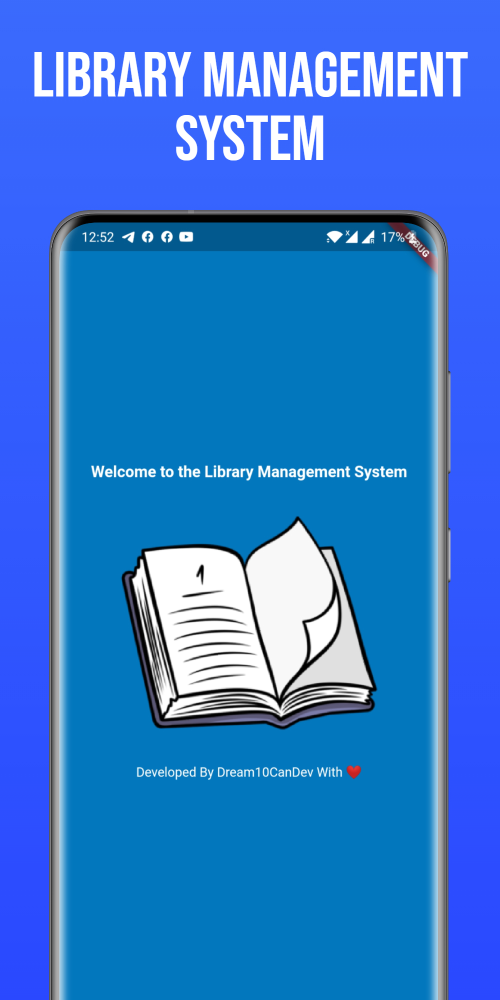
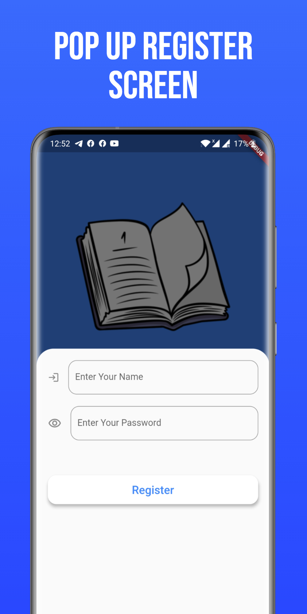
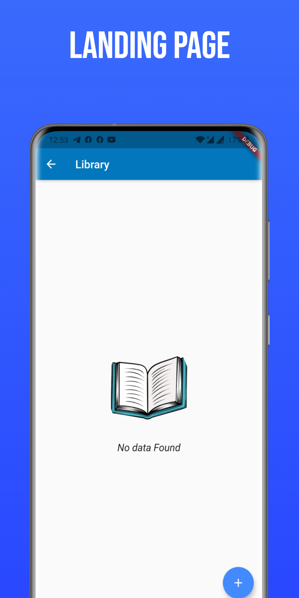
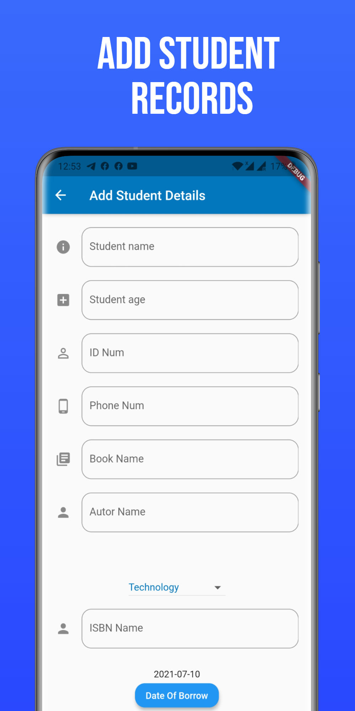
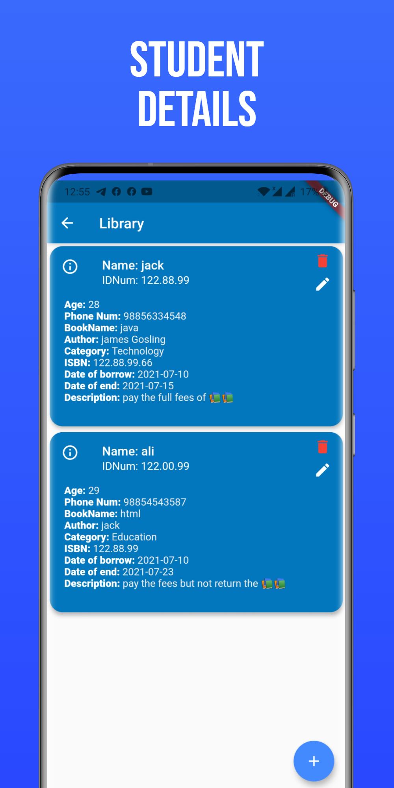
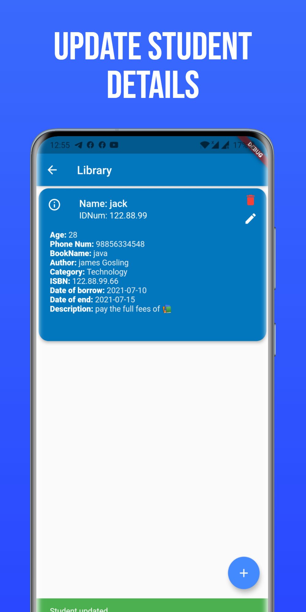

# Library Management System

<!--  -->

> “Simplicity is the soul of efficiency.”

---

### Table of Contents
You're sections headers will be used to reference location of destination.

- [Description](#description)
- [How To Use](#how-to-use)
- [License](#license)
- [Author Info](#author-info)

---

## Description

Library Management System using Flutter with awesome UI and CRUD Operation it can store the Data of Student Locally with the book name And The Date of Borrow of the Book.

#### Technologies

- Flutter
- Dart Language
- State Management Using Riverpod

[Back To The Top](#Library-Management-System)

---

## How To Use

#### Installation

### first install the Dependency in Terminal


```dart
    flutter pub get
```

## Run Flutter App

```dart
    flutter run 
```

[Back To The Top](#Library-Management-System)

---

## Splach Screen




---

## Ui Login Screen


---

## Pop Up Screen




---

## Landing page




---

## Add Student Records



---
## Student Details




---
## Update Student Details




## License

MIT License

Copyright (c) [2017] [dream10candev]

Permission is hereby granted, free of charge, to any person obtaining a copy
of this software and associated documentation files (the "Software"), to deal
in the Software without restriction, including without limitation the rights
to use, copy, modify, merge, publish, distribute, sublicense, and/or sell
copies of the Software, and to permit persons to whom the Software is
furnished to do so, subject to the following conditions:

The above copyright notice and this permission notice shall be included in all
copies or substantial portions of the Software.

THE SOFTWARE IS PROVIDED "AS IS", WITHOUT WARRANTY OF ANY KIND, EXPRESS OR
IMPLIED, INCLUDING BUT NOT LIMITED TO THE WARRANTIES OF MERCHANTABILITY,
FITNESS FOR A PARTICULAR PURPOSE AND NONINFRINGEMENT. IN NO EVENT SHALL THE
AUTHORS OR COPYRIGHT HOLDERS BE LIABLE FOR ANY CLAIM, DAMAGES OR OTHER
LIABILITY, WHETHER IN AN ACTION OF CONTRACT, TORT OR OTHERWISE, ARISING FROM,
OUT OF OR IN CONNECTION WITH THE SOFTWARE OR THE USE OR OTHER DEALINGS IN THE
SOFTWARE.

[Back To The Top](#Library-Management-System)

---

## Author Info

- Twitter - [@DreamDEV3](https://twitter.com/DreamDEV3)
- GitHub - [dream10can](https://github.com/dream10can)

[Back To The Top](#Library-Management-System)

